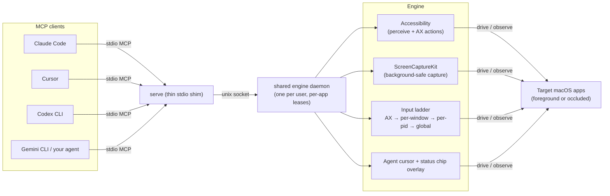

# computer-use-mcp

[](https://github.com/minghinmatthewlam/computer-use-mcp/actions/workflows/ci.yml)


**The open, agent-agnostic version of macOS computer use.** A single signed Swift
binary that exposes your Mac as a standard [MCP](https://modelcontextprotocol.io)
server. Point Claude Code, Cursor, Codex CLI, Gemini CLI, or your own agent at it
and the agent can **see and operate the apps on your Mac — in the background,
without hijacking your cursor or stealing focus.**

> **Status:** pre-1.0, used in production by the authors. The interaction engine
> runs on macOS while the Linux build, tests, CLI, and daemon plumbing are
> supported. On macOS it runs while the Mac is unlocked (the system is kept from
> idle-sleeping during active sessions; if the screen locks, mutating tools pause
> with a recoverable error until you unlock).

<!--
  HERO MEDIA PLACEHOLDER.
  When ready, drop the demo recording at assets/demo.gif and replace the table
  block below with:
      <p align="center"></p>
  Do NOT record it yet: final Wave-2/3 features are still landing; a later pass
  records it against the release build.
  The GIF should show, in one continuous take:
    1. The user typing in a foreground app (e.g. a notes window).
    2. An agent, in another client, driving a SECOND app that is occluded /
       behind other windows — clicking, typing, navigating it in the background.
    3. The smooth self-drawn agent cursor gliding to each target on the occluded
       app, plus the "Agent working" status chip, while the user's own cursor
       and keyboard focus never move.
  The point the frame must make: two operators (human + agent) working two apps
  at once, no focus fight.
-->

<table align="center" width="100%">
  <tr>
    <td align="center" height="280">
      <h3>🎬 Demo — coming soon</h3>
      <p><em>Placeholder for <code>assets/demo.gif</code></em></p>
      <p>The agent drives an <strong>occluded background app</strong> — visible
      agent cursor gliding to each target, "Agent working" chip on screen — while
      the user keeps typing in a <strong>different</strong> app. No focus fight,
      no cursor hijack.</p>
    </td>
  </tr>
</table>

<!--
  SECOND MEDIA PLACEHOLDER — teach-mode record → replay, assets/teach-replay.gif.
  Same rule: do NOT record yet; a later pass records both against the release
  build (capture via ScreenCaptureKit through the real server — a plain
  `screencapture` shell-out cannot see the agent-cursor overlay).
  This clip should show, in one take:
    1. record_skill_start, then the user (or agent) demonstrates a short task.
    2. record_skill_stop → the task is saved as a named skill.
    3. run_skill replays it at engine speed, re-resolving each element locator,
       with the agent cursor gliding through the replayed steps.
  The point: teach once, replay deterministically with no model in the loop.
-->

<table align="center" width="100%">
  <tr>
    <td align="center" height="240">
      <h3>🎓 Teach → replay — coming soon</h3>
      <p><em>Placeholder for <code>assets/teach-replay.gif</code></em></p>
      <p>Record a task once (<code>record_skill_start</code> → demonstrate →
      <code>record_skill_stop</code>), then <code>run_skill</code> replays it at
      engine speed — re-resolving each element locator, no model in the loop.</p>
    </td>
  </tr>
</table>

---

## Table of contents

- [Why it's different](#why-its-different)
- [Install](#install)
- [Quickstart per client](#quickstart-per-client)
- [How it works](#how-it-works)
- [Architecture](#architecture)
- [Tools](#tools)
- [What's new this cycle](#whats-new-this-cycle)
- [Requirements](#requirements)
- [Safety](#safety)
- [Configuration](#configuration)
- [Comparison](#comparison)
- [Distribution notes](#distribution-notes)
- [Known limitations](#known-limitations)
- [Development](#development)
- [Contributing](#contributing)
- [License](#license)

## Why it's different

- **Universal — works on every app.** Accessibility-first for precision, with an
  automatic pixel-coordinate fallback (z-order hit-testing) for apps with poor or
  absent accessibility trees. The agent's own vision provides the grounding — no
  bundled ML model. Web apps included: Chromium/Electron web-content accessibility
  is enabled on demand, and structural wrapper nodes are collapsed so deeply
  nested page content actually reaches the agent.
- **Background-safe.** A layered input ladder (AX action → per-window event →
  per-PID event, with explicit global fallback for clicks) delivers actions to the
  target app without moving the real cursor or changing focus by default. You keep
  working while the agent works.
- **Agent-agnostic.** Standard MCP over stdio. Any compliant client connects with
  one line of config — no lock-in.
- **Observable.** A smooth self-drawn agent cursor (separate from your real
  pointer) glides to each target so you can watch what the agent does.
- **Verified outcomes.** Every mutating action re-reads the target and reports
  whether the effect actually happened — not just whether the call returned
  without throwing. See [What's new this cycle](#whats-new-this-cycle).
- **Multi-session safe.** Sessions are thin shims over one shared engine daemon
  (spawned on demand, retired on version changes, self-reaping when idle), so any
  number of concurrent agents go through a single process that owns capture,
  accessibility, input, and the cursor — and per-app leases keep two agents from
  interleaving actions inside the same app.
- **Reliable.** Every action returns fresh app state (screenshot + accessibility
  tree). Elements are addressed by re-resolving locators (not stale indices), and
  destructive actions pass a confirmation policy.
- **Teach & replay.** Capture a task once and save it as a named, parameterized
  skill that replays at engine speed with no model in the loop.
- **One native binary.** Zero runtime dependencies, frictionless install.

## Install

macOS 14 or newer. On first run the binary asks for **Accessibility** and
**Screen Recording** permission (Input Monitoring is *not* required).

### From GitHub Releases (recommended once published)

> **Heads-up:** the first tagged release may not be published yet. If the
> [Releases page](https://github.com/minghinmatthewlam/computer-use-mcp/releases)
> is empty, use [build from source](#build-from-source) below. These steps are
> correct as soon as the first release is cut.

Download the notarized `.app` (or standalone binary) from the
[latest release](https://github.com/minghinmatthewlam/computer-use-mcp/releases/latest),
move it to `/Applications` (or anywhere on your `PATH`), and confirm it runs:

```bash
computer-use-mcp version
computer-use-mcp doctor          # check Accessibility / Screen Recording grants
```

A notarized, stably-signed build matters here: macOS ties Accessibility and
Screen Recording grants to a signing identity, so a notarized bundle keeps its
permissions across upgrades (see [Distribution notes](#distribution-notes)).

### Build from source

```bash
git clone https://github.com/minghinmatthewlam/computer-use-mcp.git
cd computer-use-mcp
swift build -c release
.build/release/computer-use-mcp version
```

The binary is `.build/release/computer-use-mcp`. Put it on your `PATH`, or point
your MCP client's `command` at the absolute path. To build the stable-identity
`.app` wrapper locally:

```bash
python3 scripts/build_app_bundle.py            # local .app wrapper
python3 scripts/deploy_app_bundle.py           # release build + install to ~/Applications
```

### Homebrew (coming)

A Homebrew formula is drafted under
[`packaging/homebrew/computer-use-mcp.rb`](packaging/homebrew/computer-use-mcp.rb)
as groundwork. It is **not** tapped or published yet; once the first release ships
with a stable tarball, the intended flow is:

```bash
# Not live yet — planned:
brew install minghinmatthewlam/tap/computer-use-mcp
```

## Quickstart per client

The server speaks MCP over stdio; every client launches it the same way —
`computer-use-mcp serve`. Pick your client below.

<details>
<summary><strong>Claude Code</strong></summary>

```bash
claude mcp add computer-use -- computer-use-mcp serve
```

That registers the server for the current project. Use `-s user` to register it
globally for all projects. Verify with `claude mcp list`.

</details>

<details>
<summary><strong>Cursor</strong></summary>

Add to `~/.cursor/mcp.json` (global) or `.cursor/mcp.json` (per-project):

```json
{
  "mcpServers": {
    "computer-use": { "command": "computer-use-mcp", "args": ["serve"] }
  }
}
```

</details>

<details>
<summary><strong>Codex CLI</strong></summary>

Add to `~/.codex/config.toml`:

```toml
[mcp_servers.computer-use]
command = "computer-use-mcp"
args = ["serve"]
```

</details>

<details>
<summary><strong>Gemini CLI</strong></summary>

Add to `~/.gemini/settings.json`:

```json
{
  "mcpServers": {
    "computer-use": { "command": "computer-use-mcp", "args": ["serve"] }
  }
}
```

</details>

<details>
<summary><strong>Any other MCP client</strong></summary>

Any MCP-compliant client that launches a stdio server works. The command is
`computer-use-mcp` with a single argument `serve`:

```json
{
  "mcpServers": {
    "computer-use": { "command": "computer-use-mcp", "args": ["serve"] }
  }
}
```

If the binary is not on your `PATH`, use its absolute path as `command`.

</details>

## How it works

Each MCP client spawns `serve`, a thin stdio shim; tool calls are forwarded to a
shared engine **daemon** (one per user, spawned on demand over a unix socket) that
owns accessibility, screen capture, input delivery, and the agent cursor. One
engine process means concurrent agent sessions cannot collide on shared system
services, and short per-app leases keep two sessions from interleaving actions
inside the same app. `COMPUTER_USE_MCP_NO_DAEMON=1` runs the engine in-process
instead.

Click interactions first resolve to an accessibility element and a screen point,
then descend a delivery ladder, stopping at the first tier that works:

1. **Accessibility action** (`AXPress`, etc.) — precise, background, no event posted.
2. **Per-window event** — a `windowNumber`-routed event delivered to the target
   process, so the action lands without activating the app or moving the cursor.
3. **Per-pid event** — delivered to the process when no window id resolves.
4. **Global cursor** — opt-in last resort only (`allow_global_cursor: true`); it
   moves the real pointer, then restores it.

State is re-perceived after every action and returned to the caller, so the agent
always acts on current ground truth. Element ids carry a snapshot generation, so
reusing a stale id fails loudly instead of mis-clicking.

For the precise production contract across observation, dispatch, coordinate
spaces, foreground/background guarantees, TCC requirements, stale snapshots, and
failure recovery, see [Modality Contract](docs/architecture/modality-contract.md).
For strict background focus/cursor behavior, see
[Background Control Contract](docs/architecture/background-control-contract.md).

## Architecture



A longer walkthrough of the process model, dispatch ladder, outcomes, and
source map lives in
[docs/architecture-overview.html](docs/architecture-overview.html).

## Tools

**Perceive** `get_app_state` (with `scope_element_id`/`max_elements` for huge
windows, `skeleton: true` for a shallow overview of a large tree, `ocr: true` for
apps that draw their own UI) · `find` (search elements by text — the fast way to
locate a control) · `list_apps` · `list_windows` · `read_text` · `wait_for`

**Act** `click` · `type_text` · `press_key` · `scroll` · `drag` · `set_value` ·
`select_text` · `perform_secondary_action` · `click_menu_item` · `page` (CSS
selector web interaction with DOM verification where available) · `batch` (a
short action sequence in one round-trip, stopping at the first failure)

**System** `open_app` · `open_url` · `manage_window` · `read_clipboard` ·
`write_clipboard` · `health_report`

**Skills** `save_skill` · `run_skill` · `list_skills` · `get_skill` ·
`delete_skill` · `record_skill_start` · `record_skill_stop` — teach/replay:
capture a task once (the agent performs it, **or** the user demonstrates it with
the recorder) and save it as a named, parameterized skill; element anchors are
frozen into durable locators (role + label + tree path) that re-resolve on every
run, so the skill survives app restarts and replays at engine speed with no model
in the loop. Each replayed step passes the same per-step safety gates as a live
action, steps can assert their effect (`expect`, in `wait_for` terms) and extract
data (`read_text` steps return their text in the run result), a resolved-but-moved
element **self-heals** its saved path, and a step that no longer resolves stops
the run with a report naming the nearest candidates — fix that step, re-save (or
resume with `start_at_step`), run again.

Every interaction tool accepts **either** a stable element id **or** raw
screenshot coordinates.

Action results return a reduced-resolution screenshot to keep the agent loop fast,
and skip resending the element tree when the action changed nothing (existing ids
stay valid). When the UI did change, results carry a compact diff of what changed,
appeared, or disappeared — elements that survive a change keep their ids, so
everything the agent holds stays valid. Pass `include_screenshot: false` for
tree-only results, `include_state: false` for a bare confirmation (fastest), and
call `get_app_state` whenever full-resolution pixels are needed.

## What's new this cycle

Three capabilities landed on `main` this cycle; the README documents them so it
stays truthful about current behavior.

### Verified action outcomes

Mutating tools no longer report "success = the call didn't throw." Each action
now does a read → act → re-read of the target and classifies whether the intended
effect actually occurred, surfaced in a `computer-use-mcp/outcome` block in the
result's `_meta`. The classification is one of four values:

| Classification | Meaning |
| --- | --- |
| `success` | The effect was observed, or the target was already in the requested state (an idempotent no-op is a success). |
| `unsupported` | The target cannot perform this action (disabled control, no settable value). Retrying won't help. |
| `effect_not_verified` | Dispatched without error, but no confirming change was observed — a `failure_domain` distinguishes a likely-dropped background event (`transport`, retry at a higher tier may help) from a control that lied about acting (`verification`). |
| `verifier_ambiguous` | The action may well have worked, but the verifier couldn't read enough state to prove it (secure field, unobservable menu item). Never a false failure. |

`isError` is unchanged — a thrown exception still sets it, and everything else
stays `false` — so agents that ignore `_meta` behave exactly as before. Agents
that read the outcome block get an honest verdict plus a plain-language sentence in
the text body for non-success results. The full design, including the per-tool
false-success trap matrix, is in
[docs/outcome-contract.md](docs/outcome-contract.md).

### Delivery fallback telemetry

The input ladder silently falls from tier to tier; results previously reported
only the tier that finally landed the event. A `computer-use-mcp/delivery` block
in `_meta` now carries `delivery_tier`, a `fallback_reasons` array explaining *why*
each higher tier was skipped (e.g. `axActionUnsupported`, `windowNumberUnresolved`,
`eventBridgeFailed`, `globalCursorRequested`), and `ui_changed`. This is pure
telemetry — it does not change which tier is attempted — and it lets an agent
reason about whether escalating the delivery tier is worth trying.

### Skeleton overview + dense-collection viewport windowing on `get_app_state`

Two ways to keep large windows from blowing up the tree:

- **`skeleton: true`** returns a shallow overview: the outline recurses a few
  levels, then a deeper container is emitted with a `children_count` annotation
  instead of its subtree, and stays a drill target. Pass that container's id as
  `scope_element_id` for a full scoped re-query. Skeleton is the overview,
  `scope_element_id` is the drill-in, and `max_elements` still bounds either.
- **Dense-collection viewport windowing** (automatic): virtualized collections
  (lists, tables, outlines, grids) with many children are windowed to the
  on-screen slice — preferring the app's own visible-rows attributes, else a
  viewport-frame intersection — instead of a blind first-N prefix that ignores
  scroll position. Off-window items are summarised as a count on the container's
  line (never silently dropped), and locator identity is preserved so materialised
  rows still re-resolve. `find` and skill replay opt out and see every element.

## Requirements

- macOS 14+
- Permissions granted on first run: **Accessibility** and **Screen Recording**
  (Input Monitoring is *not* required). Run `computer-use-mcp health_report` to
  inspect current identity/permission state, or `computer-use-mcp doctor --prompt`
  when you intentionally want macOS prompts.
- Linux: Swift 6.0.3 for build, tests, CLI, and daemon use; no GUI permissions
  are required.

## Safety

The server gates risky actions itself (it does not trust the calling agent).
Destructive/irreversible button clicks (Delete, Erase, Reset, …), typing into
secure password fields, and actions against apps on a confirmation list return a
recoverable `Confirmation required: …` error until the caller retries with
`"confirm": true`.

Browser pages get their own gate: before acting in a known browser the server
reads the current URL from the accessibility tree and applies the URL policy —
`url_deny` patterns block the action outright (confirm does not override),
`url_confirm` patterns (plus built-in payment-page defaults) require `confirm`
per action. The server also yields to the human: when real hardware input was seen
in the last second and the target app is the one the user is working in (or the
action uses the global cursor), the call returns a recoverable error instead of
interleaving with the user (see `interference_idle_seconds`).

See [SECURITY.md](SECURITY.md) for the TCC permission model, threat model, and
private disclosure process.

## Configuration

Every option is settable as an environment variable (`COMPUTER_USE_MCP_<KEY>`) or a
key in `~/.config/computer-use-mcp.json` (env wins):

| Key (file) / variable | Effect |
| --- | --- |
| `cursor` / `COMPUTER_USE_MCP_CURSOR=0` | Hide the animated agent-cursor overlay (on by default; set 0 for headless/CI). |
| `cursor_idle_fade` | Seconds of quiet before the agent cursor fades (default 12). |
| `cursor_topmost` / `COMPUTER_USE_MCP_CURSOR_TOPMOST=1` | Keep the agent cursor unconditionally above every window (escape hatch from target-relative z-order). |
| `status_chip` / `COMPUTER_USE_MCP_STATUS_CHIP=0` | Hide the "Agent working" pill shown on every display during activity (on by default). |
| `no_safety` / `COMPUTER_USE_MCP_NO_SAFETY=1` | Disable the safety policy entirely. |
| `confirm_apps` | Apps (name or bundle id) where every action needs `confirm`. |
| `destructive` | Extra destructive label substrings to gate. |
| `url_deny` | URL substrings where browser actions are blocked outright (`confirm` does not override). |
| `url_confirm` | Extra URL substrings where browser actions need `confirm` (defaults cover payment pages). |
| `ax_timeout` | Per-call accessibility timeout in seconds (default 2). |
| `ax_element_timeout` | Per-element AX messaging timeout during tree traversal (default 0.25s). |
| `viewport_probe_timeout` | Tighter AX timeout for dense-collection viewport frame probes (default 0.05s). |
| `read_text_visible_threshold` | Character count above which `read_text` auto-switches to the visible-range path (default 50000). |
| `no_daemon` / `COMPUTER_USE_MCP_NO_DAEMON=1` | Run the engine in-process instead of through the shared daemon. |
| `no_app_lease` | Disable per-app session arbitration. |
| `app_lease_seconds` | How long an app stays leased to a session after its last action (default 10). |
| `no_interference_yield` | Disable yielding to real user input (yield is on by default). |
| `interference_idle_seconds` | Hardware quiet time required before acting in the app the user is working in, or via the global cursor (default 1; 0 disables). |
| `no_sleep_assertion` | Do not hold a prevent-idle-sleep assertion while tool calls are flowing. |
| `no_telemetry` / `COMPUTER_USE_MCP_NO_TELEMETRY=1` | Disable funnel/telemetry recording. |
| `show_meta` / `COMPUTER_USE_MCP_SHOW_META=1` | Dump `_meta` (focus / delivery / outcome) on `call` harness output. |
| `log` / `COMPUTER_USE_MCP_LOG=1` | Per-tool-call stderr log lines (name, ok/error, duration). |
| `max_actions_per_sec` | Optional global throttle on tool calls (off by default). |
| `COMPUTER_USE_MCP_SKYLIGHT=1` | Env-only: enable the opt-in SkyLight `SLEventPostToPid` input rung (not a config-file key). |

## Comparison

How computer-use-mcp relates to the closest projects. This is a factual snapshot;
cells marked "Not public" mean the project is closed-source and the behavior isn't
documented, not that it's absent.

| | **computer-use-mcp** | OpenAI Codex computer use | actuallyepic/background-computer-use | lahfir/agent-desktop |
| --- | --- | --- | --- | --- |
| **Protocol** | MCP over stdio (agent-agnostic) | Closed, Codex-only | HTTP loopback (no auth) | Rust CLI |
| **Background input** | AX action → per-window → per-pid event ladder, opt-in global cursor | Not public | Weaker; only physical path is an experimental WindowServer route | Global HID tap (raises windows) |
| **Capture API** | ScreenCaptureKit | Not public | `CGWindowListCreateImage` (deprecated) | `screencapture` shell-out |
| **Verified outcomes** | Yes (classification enum in `_meta`) | Not public | Yes | Yes |
| **Skills / teach-replay** | Yes | No | No | No |
| **Visible agent cursor** | Yes (self-drawn overlay) | Not public | No | No |
| **Multi-session** | Yes (shared daemon + per-app leases) | N/A (hosted) | No | No |
| **Safety gates** | Yes (destructive / URL / interference / screen-lock) | Provider-side | Minimal (no auth) | Not documented |
| **License** | MIT (open source) | Closed | Open source | Open source |

The two independent open-source efforts above both converged on verified outcomes
("don't trust an AX success — re-read and confirm the effect"), which is the model
computer-use-mcp adopts in [docs/outcome-contract.md](docs/outcome-contract.md).
computer-use-mcp's distinguishing bets are the standard MCP surface, the
teach/replay skills layer, the shared-daemon multi-session model, and the visible
agent cursor.

## Distribution notes

The binary needs **Accessibility** and **Screen Recording** permission, and macOS
ties those grants to the *host process* that spawns the server (your terminal or
agent app). A rebuilt binary keeps its grants; a different host needs its own. Use
`computer-use-mcp health_report --json` to record the current executable, bundle id
(if any), parent process, permission state, and daemon socket/secret paths without
revealing daemon secrets. Add `--probe-capture` when you intentionally want a
bounded ScreenCaptureKit/replayd responsiveness probe. For redistribution, codesign
with a Developer ID and notarize
(`codesign --sign "Developer ID Application: ..." && xcrun notarytool submit ...`)
so TCC grants attach to a stable identity. See
[Permissions and app identity](docs/release/permissions.md) for the first
productionization checklist.

## Known limitations

- Background delivery uses macOS per-process event posting, which is
  app-dependent: a few apps that require real keyboard focus (e.g. some pro audio
  apps, secure input fields) may ignore background events. For clicks, use
  `allow_global_cursor: true` as an explicit fallback.
- Menu key-equivalents (e.g. `cmd+a`) are reliable when the app is the key window;
  some apps ignore them when targeted purely in the background.
- The interaction engine is macOS-only (Accessibility, ScreenCaptureKit, and
  CoreGraphics). Linux tools that require those capabilities return structured
  unsupported errors; the protocol/tool layer is OS-agnostic.

## Development

```bash
swift build
swift test
.build/debug/computer-use-mcp serve                  # run the stdio MCP server
.build/debug/computer-use-mcp call get_app_state '{"app":"Calculator"}'   # drive one tool
.build/debug/computer-use-mcp health_report --json   # non-mutating diagnostics
.build/debug/computer-use-mcp health_report --probe-capture   # bounded capture-service probe
.build/debug/computer-use-mcp doctor                 # check permissions
python3 scripts/preflight.py                         # CI-safe release preflight
python3 scripts/build_app_bundle.py                  # local .app wrapper build
python3 scripts/deploy_app_bundle.py                 # release build + bundle + install to ~/Applications + daemon handover
python3 scripts/deploy_app_bundle.py --check         # exit 1 if the installed bundle is older than source/build
python3 scripts/preflight.py --use-app-bundle        # non-live checks through the .app executable
python3 scripts/e2e_demo.py                          # safe structured smoke artifact; no GUI mutation
```

Default CI covers the non-mutating path: package build, pure unit tests, and CLI
`version`/`help`/`health_report --json` smoke checks. Live app-control checks are
local-only because they require a logged-in macOS desktop plus Accessibility/Screen
Recording permission and can operate real apps. See
[Testing and Preflight](docs/TESTING.md) for the testing tiers, local command loop,
and release preflight expectations. The architecture-level behavior target for
these tiers is captured in
[Modality Contract](docs/architecture/modality-contract.md).

### Benchmark and smoke tiers

Use deterministic checks for hosted CI and live GUI checks only on a local Mac or a
future self-hosted macOS runner with explicit permissions.

| Tier | What it proves | Safe for hosted CI? | Command |
| --- | --- | --- | --- |
| Deterministic unit tests | Pure Swift behavior such as parsing, safety policy, coordinates, and tree shaping. | Yes | `swift test` |
| Structured dry-run smoke | The benchmark entrypoint, schema, git/macOS metadata collection, and opt-in gate. It does not start the MCP server or open apps. | Yes | `python3 scripts/e2e_demo.py` |
| Release preflight | Build, unit tests, CLI smoke, health report, and dry-run background eval in one JSON report. | Yes | `python3 scripts/preflight.py` |
| Local app-bundle runtime | Produces an ad-hoc signed `.app` wrapper and runs non-live CLI/dry-run checks through `Contents/MacOS/computer-use-mcp`. | No | `python3 scripts/preflight.py --use-app-bundle` |
| Deterministic background eval | The fixture-app path mutates a stable AX text field while preserving the current frontmost app. | No | `python3 scripts/live_background_eval.py --live` |
| Real-app compatibility smoke | Lightweight live matrix for Finder read-only discovery and TextEdit background stdio behavior. | No | `python3 scripts/real_app_smoke.py --live` |
| Live GUI smoke | The real MCP stdio path against TextEdit in the background, including perceive, type, select, and focus-stability checks. Setup launches TextEdit without activation and fails if the current frontmost app changes. | No | `python3 scripts/e2e_demo.py --live` |

Live GUI mutation is opt-in. Use `--live` for local manual runs. Do not add the
live tier to hosted CI — it depends on an unlocked macOS desktop, TCC permissions,
Finder/TextEdit behavior, and user-visible app state. Before running the live tier,
build the binary and make sure the spawning terminal has Accessibility and Screen
Recording permission:

```bash
swift build
.build/debug/computer-use-mcp doctor --prompt
python3 scripts/e2e_demo.py --live
```

## Contributing

Contributions welcome. See [CONTRIBUTING.md](CONTRIBUTING.md) for build/test
conventions and PR expectations, [SECURITY.md](SECURITY.md) for the security model
and private disclosure process, and [CHANGELOG.md](CHANGELOG.md) for release
history.

## License

MIT — see [LICENSE](LICENSE).
</content>
</invoke>
